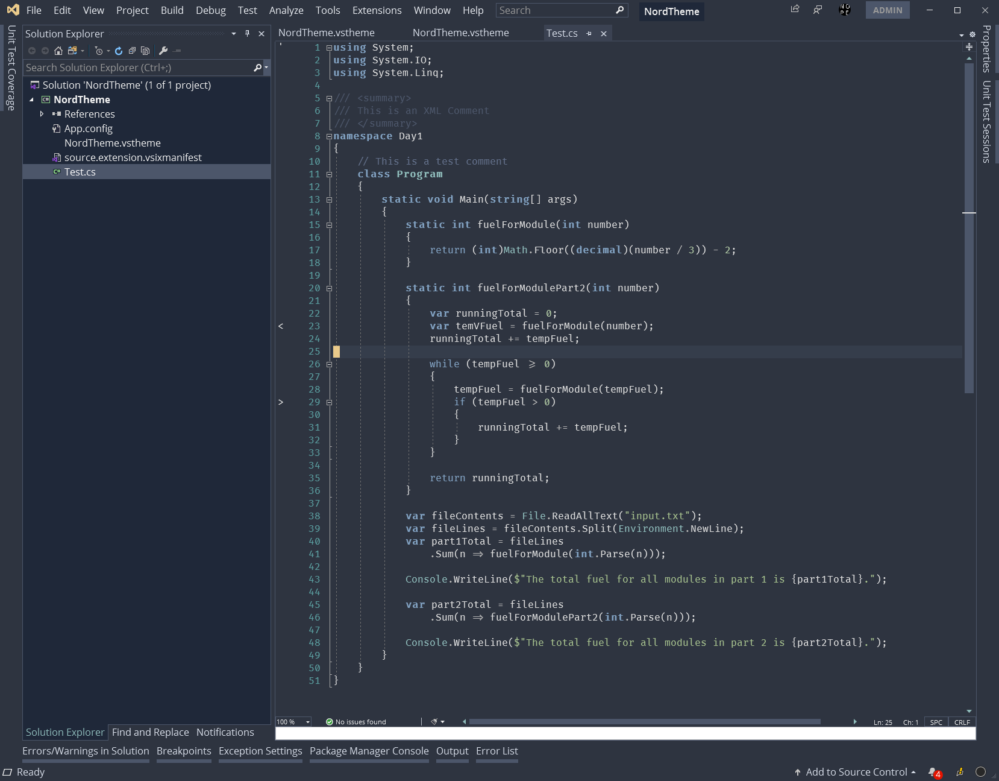

# Nord Visual Studio Theme

## Summary

This is an attempt at porting [Nord VS Code Theme](https://github.com/arcticicestudio/nord-visual-studio-code) for [Nord](https://www.nordtheme.com/) to Visual Studio 2019.

## Progress

> This is a work in progress

## Requirements

1. Visual Studio 2019
1. [Visual Studio Color Theme Designer](https://marketplace.visualstudio.com/items?itemName=ms-madsk.ColorThemeDesigner) installed

## Installation

1. Clone the repository
1. Open the `NordTheme.sln`
1. Open the `NordTheme.vstheme`
1. Click `Apply`
1. Once this is done, import the `NordThemeLargeFont.vssettings`

    The reason for importing the settings at the end is that I have made a lot of changes to the theme after the initial work was done in the Color Theme Designer.

    Sadly, the Color Theme Designer is full of bugs and it is not easy to work with. There doesn't seem to be a lot of traction for updating it either, so we work with what we can get.

## Steps to Update and Preview the Theme

1. Ensure you have Visual Studio 2019
1. Clone this repository
1. Open `NordTheme.sln`
1. Double click on the `NordTheme.vstheme`
1. Make modifications in the right properties (there are a lot of them)
1. Click on Apply or Preview (I had issues with Preview, so I just used Apply)

> One note, Apply actually installs it on all instances of Visual Studio 2019

## VSSettings File Information

The settings file included is an on-going living setup that further fine-tunes the theme post install. It makes use of Open Sans for the UI and Fira Code for the editor. Feel free to modify as you see fit, but if you contribute a new set of settings, please start a new file for alternate styles.

## Common Bugs Working with the Color theme Designer

- **NordTheme(1...) Multiple Installed Extensions** - Opening and applying the theme will install it as an extension. It will install as a unique extension every time you close and open the solution and click apply. This leaves you with a bunch of extensions installed if you don't clean them up. It helps to uninstall the themes when you go back to make modifications to the original.
- **Font Struggles** - Every time you apply a new theme, be prepared to reset your fonts. For me it was defaulting back to Consolas size 9 after every apply. There does not appear to be a way to set the default font in the theme that I could find.
- **Gradients Everywhere** - Visual Studio uses a lot of gradients throughout the application. I was handling these by either matching all colors, or just setting all the alpha channels to transparent.

## Contributions

There are still many colors that need to be cleaned and made uniform.

Willing to accept any and all contributions. I love the Nord theme and have been using it for everything so far. My love for the Visual Studio editor had me do this in my spare time. 

If there are issues, please feel free to log them. If you have a fix for them feel free to submit the fix.