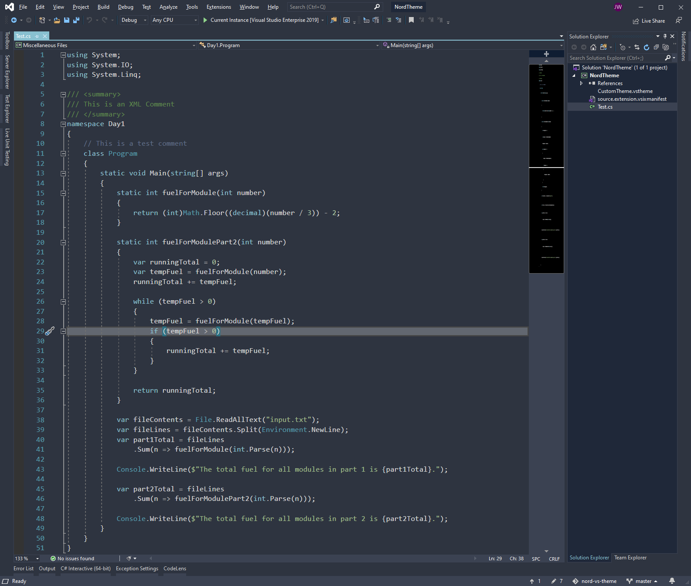

# Nord Visual Studio Theme

## Summary

This is an attempt at porting [Nord VS Code Theme](https://github.com/arcticicestudio/nord-visual-studio-code) for [Nord](https://www.nordtheme.com/) to Visual Studio 2019.

## Progress

> This is a work in progress

## Steps to Update and Preview the Theme

1. Ensure you have Visual Studio 2019
1. Install this Visual Studio extension [Visual Studio Color Theme Designer](https://marketplace.visualstudio.com/items?itemName=ms-madsk.ColorThemeDesigner)
1. Clone this repository
1. Open NordTheme.sln
1. Double click on the NordTheme.vstheme
1. Make modifications in the right properties (there are a lot of them)
1. Click on Apply or Preview (I had issues with Preview, so I just used Apply)

> One note, Apply actually installs it on all instances of Visual Studio 2019

## Contributions

Willing to accept any and all contributions. I love the Nord theme and have been using it for everything so far. My love for the Visual Studio editor had me do this in my spare time. 

If there are issues, please feel free to log them. If you have a fix for them feel free to submit the fix.