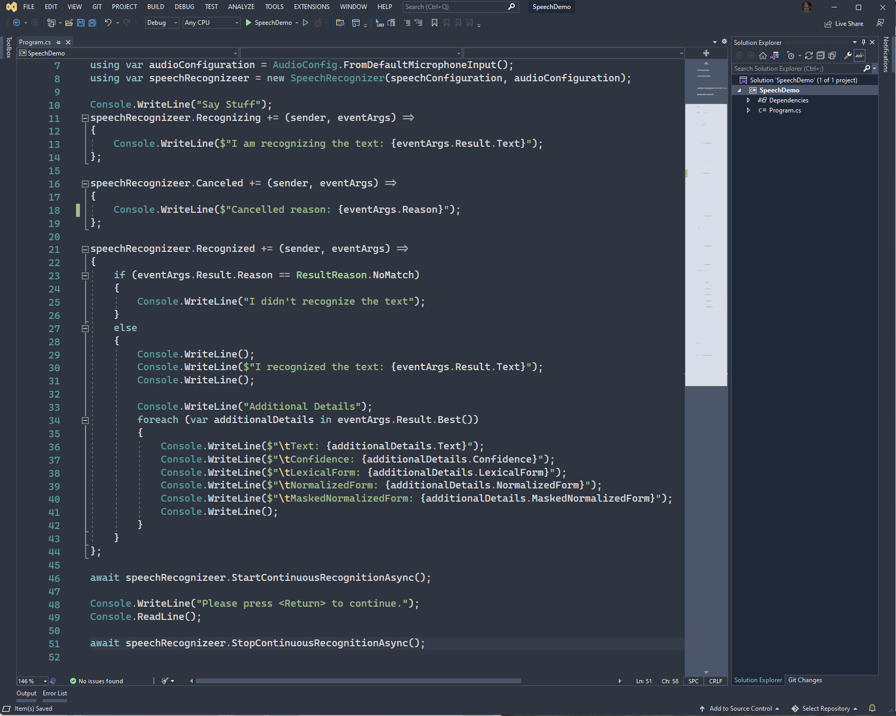

<h1 align="center" style="text-align: center">
Nord Visual Studio Theme  
</h1>

## Summary

This is a port of [Nord](https://www.nordtheme.com/) to Visual Studio 2019.

> Font used is [Cascadia Code](https://docs.microsoft.com/en-us/windows/terminal/cascadia-code)

## Requirements

1. Visual Studio 2019
2. [Visual Studio Color Theme Designer](https://marketplace.visualstudio.com/items?itemName=ms-madsk.ColorThemeDesigner) installed

## Installation / Update

1. Clone the repository
3. Open the `NordTheme.sln`
4. Uninstall any existing `Nord` theme
5. Build the project
6. Close Visual Studio and navigate to the output folder
7. Double click the `NordTheme.vsix`
8. Install and restart Visual Studio
9. Select `Nord` from the Color Schemes

## Contributions

There are still many colors that need to be cleaned and made uniform.

Willing to accept any and all contributions. I love the Nord theme and have been using it for everything so far. My love for the Visual Studio editor had me do this in my spare time. 

If there are issues, please feel free to log them. If you have a fix for them feel free to submit the fix.
